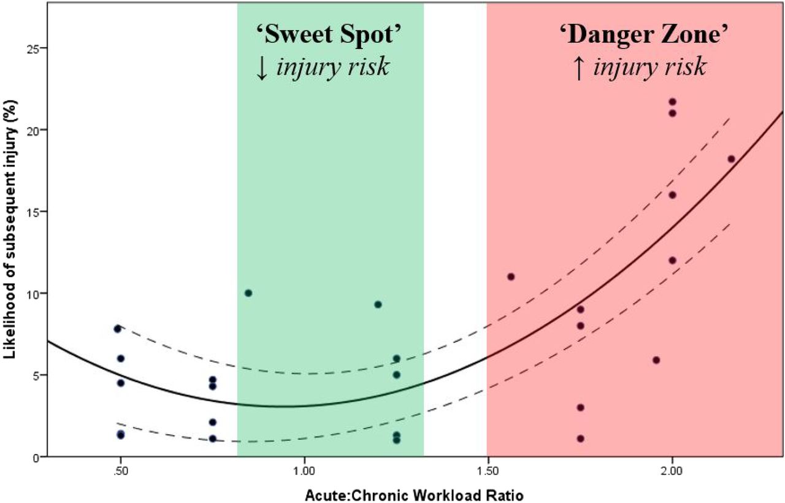

```{r setup, include=FALSE}
knitr::opts_chunk$set(echo = TRUE)
```

```{r}
#install.packages(tidyr)
library(tidyr)
library(ggplot2)
```


For this analysis our objective is to develop a dataset that we can use as a proof of concept to demonstrate the benefits of a technology which we have not yet acquired. In this case we would like to develop simulated data which will allow us to demonstrate the effectiveness of measuring players hamstrings and groin strength to prevent injury. We would also like to be able to test models on this dataset to identify if they predict injury in the future. 

# Initial Data

For this analysis the data we initially have access to is player GPS and some player summary data. Let's load this data into R:

```{r}
# Load data into R
load("gps_and_player_data.rda")
```


Let's view the data we have, firstly let's look at the player data frame:

```{r}
# Print out player data frame
players
```

Here we have player names, their position, subjective measures of their speed and strength, their height and weight, current value and peak value. 

Let's next view the admin data:

```{r}
# View admin data
head(admin_dat)
```

Here we have some information on the player name and what activity they performed on a given day. 

Let's next view the GPS data we have access too:

```{r}
# View GPS data
head(gps_data)
```

In this dataset we have certain GPS metrics for each of the players on a given day. 

We next want to check the dimensions of the data sets we have:

```{r}
dim(admin_dat) # Check admin dat dimensions
dim(gps_data) # Check GPS data dimensions
dim(players) # Check player data dimensions
```

We see we have 9060 rows in the admin and GPS data corresponding to each day of physical activity in the last two seasons. The player data has 20 rows, each corresponding to a player on the squad. 

# Making calculation functions

While the GPS data in itself is useful we hypothesize that player performance is likely determined by what a player has done in the past couple of weeks instead of on a single day. To try and capture this effect we are fist interested in the sum of total work the player has performed in a previous period. 

The optimal way to do this is to create some functions so that we can re-use them when encountering future data. 

We want to create two functions here that accomplish the following two tasks:

* Calculate the sum of a metric over a given window of days.
* Calculate the Acute/Chronic ratio of metric over two windows of days.




#### Pseudo Code

When starting writing a function it is often beneficial to write out what it is you would like the code to do prior to writing a function. Let's do that first:

First thing we want to decide is our inputs and outputs to the function:

Output:
* For each day we would like the function to return the sum of values for a previous window of days. 

Input:
* The GPS metric to calculate the sum, the number of days to calculate the window for, the days each metric was recorded on, the GPS data to use for calculating the metric.

Then let's break down what needs to happen inside the function:

* Create an empty vector to store results
* For each day, identify the metric measurements which have fallen in a given window
* Sum up the previous measurements from the window
* Store them in a result vector.

Let's tackle this piece by piece. First we want to create an empty vector. We can create this as a vector of NA values:

```{r}
# Create empty vector to store results
sum_vec <- rep(NA, nrow(gps_data))
```

Next we want to loop through and identify days which fall in a given window, lets call that window "days". We also want to sum up the measurements we have extracted. 

```{r}
# Set days parameter
days <- 7
# Set metric parameter
met <- "total_distance"
# For each row of results data frame
for(i in 1:nrow(gps_data)){
  # Extract previous data which falls in given window, for given metric
  temp_vec <- gps_data[which(admin_dat$players == admin_dat$players[i] & # For that player
                             admin_dat$days < admin_dat$days[i] & # Prior to given day
                             admin_dat$days >= (admin_dat$days[i] - days)), # Greater than or equal to current day minus the window
                       c(met)] # Select metric column
  
  # Calculate sum of the values and assign to result vector
  sum_vec[i] <- sum(temp_vec, na.rm = T)
}
```

Suppose, we try to run sum on our extracted metric but there are no observations which fall within that window. This would likely return an error so we want to add a check to ensure that we are only running the sum function when there is something to calculate:

```{r}
# Set days parameter
days <- 7
# For each row of results data frame
for(i in 1:nrow(gps_data)){
  # Extract previous data which falls in given window, for given metric
  temp_vec <- gps_data[which(admin_dat$players == admin_dat$players[i] & # For that player
                             admin_dat$days < admin_dat$days[i] & # Prior to given day
                             admin_dat$days >= (admin_dat$days[i] - days)), # Greater than or equal to current day minus the window
                       c(met)] # Select metric column
   # If the length of this vector is at least 1
    if(length(temp_vec) >= 1){
      # Calculate sum of the values and assign to result vector
      sum_vec[i] <- sum(temp_vec, na.rm = T)
    }
}
```

Let's then add this all together and wrap it in a function. At the end of our function we need to specify what to return from the function, in this case it is our calculated "sum_vec" object.

```{r}
sum_days <- function(gps_data, admin_dat, met, days){
   # Create empty vector to store results
  sum_vec <- rep(NA, nrow(gps_data))
  # For each row of results data frame
  for(i in 1:nrow(gps_data)){
    # Extract previous data which falls in given window, for given metric
    temp_vec <- gps_data[which(admin_dat$players == admin_dat$players[i] &
                               admin_dat$days < admin_dat$days[i] &
                               admin_dat$days >= (admin_dat$days[i] - days)),c(met)]
    # If the length of this vector is at least 1
    if(length(temp_vec) >= 1){
      # Calculate sum of the values and assign to result vector
      sum_vec[i] <- sum(temp_vec, na.rm = T)
    }
  }
  # Return result vector
  return(sum_vec)
}
```

Let's next test out our function to ensure that it runs:

```{r}
total_distance_sum_7 <- sum_days(gps_data, # Set GPS data
                                 admin_dat,  # Set admin data
                                 met = "total_distance", # Set metric
                                 days = 7) # Set window of days to generate calculation for

```

And view the results:

```{r}
summary(total_distance_sum_7)
```


Finally we want to add some documentation to our function to specify what it does, what the arguments are, and what is returned by the function so that we can quickly identify its use if we return to it later. It is also useful to include a small example in the documentation so that we can quickly see how the function works:

```{r}
# Define sum days function
sum_days <- function(gps_data, admin_dat, met, days){
  #'
  #' This function calculates the sum of a given metric over a 
  #' period of time.
  #'
  #' @param gps_data Data frame of metrics over a given period
  #' @param admin_data Data frame of adminstration variables, with 
  #' columns of players, indicating player id, and days, indicating the
  #' day each metric was measured on
  #' @param met The metric to calculate the sum for
  #' @param days The time window to calculate the sum for
  #' 
  #' @return A vector containing the summed variable over the 
  #' previous days period for each row.
  #'
  #' @examples
  #' g_data <- data.frame(distance = c(1,2,3,4))
  #' a_data <- data.frame(players = c(1,1,1,1),
  #'                          days = c(1,2,3,4))
  #' sum_res <- sum_days(gps_data = g_data,
  #'                     admin_dat = a_data,
  #'                     met = "distance",
  #'                     days = 2)
  #'
  
  # Create empty vector to store results
  sum_vec <- rep(NA, nrow(gps_data))
  # For each row of results data frame
  for(i in 1:nrow(gps_data)){
    # Extract previous data which falls in given window, for given metric
    temp_vec <- gps_data[which(admin_dat$players == admin_dat$players[i] &
                               admin_dat$days < admin_dat$days[i] &
                               admin_dat$days >= (admin_dat$days[i] - days)),c(met)]
    # If the length of this vector is at least 1
    if(length(temp_vec) >= 1){
      # Calculate sum of the values and assign to result vector
      sum_vec[i] <- sum(temp_vec, na.rm = T)
    }
  }
  # Return result vector
  return(sum_vec)
}

```

Let's define a similar function to calculate the A:C ratios for each metric:

```{r}
ac_ratio <- function(gps_data, admin_dat, met, days_1, days_2){
  #'
  #' This function calculates the acute:chronic ratio for a given 
  #' metric over a set time period. 
  #' 
  #' @param gps_data A data frame containing metric values
  #' @param admin_data Data frame of adminstration variables, with 
  #' columns of players, indicating player id, and days, indicating the
  #' day each metric was measured on.
  #' @param met The metric of interest
  #' @param days_1 - The number of days to use for the acute window
  #' @param days_2 - The number of days to use for the chronic window
  #'
  #' @return A vector of the acute chronic window corresponding to each
  #' row in gps_data and admin_db
  #'
  #' @examples
  #' g_data <- data.frame(distance = c(1,2,3,4))
  #' a_data <- data.frame(players = c(1,1,1,1),
  #'                          days = c(1,2,3,4))
  #' ac_res <- ac_ratio(gps_data = g_data,
  #'                    admin_dat = a_data,
  #'                    met = "distance",
  #'                    days_1 = 1,
  #'                    days_2 = 2)
  #'
  
  # Calculate the sum of values for the acute window
  sum_vec_1 <- sum_days(gps_data, admin_dat, met = met, days = days_1)
  # Calculate the sum of values for the chronic window
  sum_vec_2 <- sum_days(gps_data, admin_dat, met = met, days = days_2)
  # Modify the chronic vector to same level as acute
  mod_sum_vec_2 <- sum_vec_2 * (days_1/days_2)
  # Calculate AC ratio
  ac_ratio <- sum_vec_1/mod_sum_vec_2
  # Return ac ratio vector
  return(ac_ratio)
}
```


## Calculating Metrics

Now that we have defined functions to calculate some metrics let's generate some calculations for our dataset. Here we want to calculate:

* The sum over 7 days
* The sum over 28 days
* The sum over 56 days
* The A:C ratio for 7:21 (Week to last three weeks)
* The A:C ratio for 28:56 (Month to last two months)

First let's create some empty data frames to store our results:

```{r}
# Create empty data frames to store our results
sum_7_res <- sum_28_res <- sum_56_res <- ac_7_21_res <- ac_28_56_res <-  as.data.frame(matrix(NA, nrow = nrow(gps_data), ncol = ncol(gps_data)))
```

Next let's loop through each of the metrics and calculate the results:

```{r}
# For each column in the gps data
for(i in 1:ncol(gps_data)){
  # Calculate the sum over 7 days
  sum_7_res[,i] <- sum_days(gps_data, # Set GPS data
                            admin_dat,  # Set Admin data
                            met = names(gps_data)[i], # Set metric to use
                            days = 7) # Set window size
  
  # Calculate the sum over 28 days
  sum_28_res[,i] <- sum_days(gps_data, # Set GPS data
                             admin_dat,  # Set admin data
                             met = names(gps_data)[i], # Set metric to use
                             days = 28) # Set window size
  
  # Calculate the sum over 56 days
  sum_56_res[,i] <- sum_days(gps_data, # Set GPS data
                             admin_dat, # Set admin data
                             met = names(gps_data)[i], # Set metric to use
                             days = 56) # Set window size
  
  # Calculate the A:C ratio for 7:21
  ac_7_21_res[,i] <- ac_ratio(gps_data, # Set GPS data
                              admin_dat, # Set admin data
                              met = names(gps_data)[i], # Set metric to use
                              days_1 = 7, # Set acute window
                              days_2 = 21) # Set chronic window
  
  # Calculate the A:C ratio for 28:56
  ac_28_56_res[,i] <- ac_ratio(gps_data, # Set GPS data
                               admin_dat, # Set admin data
                               met = names(gps_data)[i], # Set metric to use
                               days_1 = 28, # Set acute window
                               days_2 = 56) # Set chronic window
  
}
```

Next up we need to fix the names of the result data frames we have calculated so that we can tell which metric is which:

```{r}
# Set names for 7 day sums
names(sum_7_res) <- paste(names(gps_data), "_sum_7_days", sep="")
# Set names for 28 day sums
names(sum_28_res) <- paste(names(gps_data), "_sum_28_days", sep="")
# Set names for 56 day sums
names(sum_56_res) <- paste(names(gps_data), "_sum_56_days", sep="")
# Set names for A:C 7:21
names(ac_7_21_res) <- paste(names(gps_data), "_ac_7_21", sep="")
# Set names for A:C 28:56
names(ac_28_56_res) <- paste(names(gps_data), "_ac_28_56", sep="")

```

Finally we want to rejoin all our data together so that we have a single data frame to work with:

```{r}
# Join data together
met_dat <- cbind.data.frame(gps_data,sum_7_res, sum_28_res, ac_7_21_res, ac_28_56_res, sum_56_res)
```

Let's visualize some of the metrics over time. First we will extract the data for a single player and convert it into long-form:

```{r}
a_dat_kdb <- admin_dat[admin_dat$players == "Kevin De Bruyne",]
met_dat_kdb <- met_dat[admin_dat$players == "Kevin De Bruyne",]

kdb_plot_dat <- cbind.data.frame(a_dat_kdb[,c("days", "event")],met_dat_kdb)

kdb_long <- pivot_longer(kdb_plot_dat, cols = names(met_dat))
```

Now we can plot a timeline of some of the metrics. First let's look at the base metrics;

```{r}
# Create plot
g_1 <- ggplot(kdb_long[kdb_long$name %in% c("total_distance", 
                                            "total_time",
                                            "HSR",
                                            "accelerations",
                                            "decelerations"),], # Set data
              aes(x = days, y = value, color = name)) + # Set aesthetics
  geom_point(aes(shape = event), alpha = 0.3) + # Set geom point for scatter plot
  geom_smooth() + # Add smoothing line
  facet_wrap(~name, scales = "free", nrow = 3) + # Make small multiples
  theme(axis.line = element_line(colour = "black"), # Set axis line as black
        panel.grid.major = element_blank(), # Remove grid
        panel.grid.minor = element_blank(), # Remove grid
        panel.border = element_blank(), # Remove grid
        panel.background = element_blank()) + # Remove grid 
labs(x = "Days", y = "Metric Value", # Add labels
     title = "Kevin De Bruyne", shape = "Event\nType") +
  guides(color = FALSE) # Turn off color legend
# Generate plot
g_1
```

So his base metrics look relatively constant over time on a daily basis, with the only real discrepancies coming at the start of the season for total time, likely indicating longer pre-season training sessions. High speed running also appears to peak at the end of the season. 

Next let's visualize the short term workload sums:

```{r}
# Create plot
g_2 <- ggplot(kdb_long[kdb_long$name %in% c("total_distance_sum_7_days",
                                            "total_time_sum_7_days", 
                                            "HSR_sum_7_days",
                                            "accelerations_sum_7_days",
                                            "decelerations_sum_7_days"),], # Set dataset
              aes(x = days, y = value, color = name)) + # Set aesthetics
  geom_point(aes(shape = event), alpha = 0.3) + # Set geom point
  geom_smooth() + # Add smothing line
  facet_wrap(~name, scales = "free", nrow = 3) + # Split data into small multiples
  theme(axis.line = element_line(colour = "black"), # Set axis line as black
        panel.grid.major = element_blank(), # Remove grid
        panel.grid.minor = element_blank(), # Remove grid
        panel.border = element_blank(), # Remove grid
        panel.background = element_blank()) + # Remove grid 
labs(x = "Days", y = "Metric Value",  # Add labels
     title = "Kevin De Bruyne", shape = "Event\nType") +
  guides(color = FALSE) # Turn off color legend
# Generate plot
g_2
```

This shows similar patterns to the base metrics which more pronounced increases in time at the start and end of the season. We also see the total amount of accelerations and decelerations increases during the pre-season. 

Let's also visualize the long-term sums of workload:

```{r}
# Create plot
g_3 <- ggplot(kdb_long[kdb_long$name %in% c("total_distance_sum_56_days",
                                            "total_time_sum_56_days", 
                                            "HSR_sum_56_days",
                                            "accelerations_sum_56_days",
                                            "decelerations_sum_56_days"),], # Set dataset
              aes(x = days, y = value, color = name)) + # Set aesthetics
  geom_point(aes(shape = event), alpha = 0.3) + # Add geom point
  geom_smooth() + # Add smoothing line
  facet_wrap(~name, scales = "free", nrow = 3) + # Make small multiples
  theme(axis.line = element_line(colour = "black"), # Set axis line as black
        panel.grid.major = element_blank(), # Remove grid
        panel.grid.minor = element_blank(), # Remove grid
        panel.border = element_blank(), # Remove grid
        panel.background = element_blank()) + # Remove grid 
labs(x = "Days", y = "Metric Value",  # Set labels
     title = "Kevin De Bruyne", shape = "Event\nType") +
  guides(color = FALSE) # Turn off color legend
# Generate plot
g_3
```

Here we see the pre-season effect being captured for each of the metrics, with a tail slowly increasing until it hits the in-season level. This appears to spike after month or two into the season (likely capturing the effect of pre-season training) and then decrease before increasing again at the end of each season. 

Now let's look at the 7:21 A:C ratios:

```{r}
# Create plot
g_4 <- ggplot(kdb_long[kdb_long$name %in% c("total_distance_ac_7_21",
                                            "total_time_ac_7_21", 
                                            "HSR_ac_7_21",
                                            "accelerations_ac_7_21",
                                            "decelerations_ac_7_21"),], # Set dataset
              aes(x = days, y = value, color = name)) + # Set aesthetics
  geom_point(aes(shape = event), alpha = 0.3) + # Add geom point
  geom_smooth() + # Add smoothing line
  facet_wrap(~name, scales = "free", nrow = 3) + # Make small multiples
  theme(axis.line = element_line(colour = "black"), # Set axis line as black
        panel.grid.major = element_blank(), # Remove grid
        panel.grid.minor = element_blank(), # Remove grid
        panel.border = element_blank(), # Remove grid
        panel.background = element_blank()) + # Remove grid 
labs(x = "Days", y = "Metric Value", # Add labels to graph
     title = "Kevin De Bruyne", shape = "Event\nType") +
  guides(color = FALSE) # Turn off legend for color
# Generate plot
g_4
```

Here we see one of the key problems with the metric in that it is capturing the start of the season and giving a greatly inflated A:C ratio value. Let's drop anything with an A:C ratio greater than 2 and re-generate the plot:

```{r}
# Create plot
g_5 <- ggplot(kdb_long[which(kdb_long$name %in% c("total_distance_ac_7_21",
                                            "total_time_ac_7_21", 
                                            "HSR_ac_7_21",
                                            "accelerations_ac_7_21",
                                            "decelerations_ac_7_21") &
                         kdb_long$value < 2),], # Set dataset
              aes(x = days, y = value, color = name)) + # Set aesthetics
  geom_point(aes(shape = event), alpha = 0.3) + # Set geom point
  geom_smooth() + # Add smoothing line
  facet_wrap(~name, scales = "free", nrow = 3) + # Create small multiples
  theme(axis.line = element_line(colour = "black"), # Set axis line as black
        panel.grid.major = element_blank(), # Remove grid
        panel.grid.minor = element_blank(), # Remove grid
        panel.border = element_blank(), # Remove grid
        panel.background = element_blank()) + # Remove grid 
labs(x = "Days", y = "Metric Value", # Set labels
     title = "Kevin De Bruyne", shape = "Event\nType") +
  guides(color = FALSE) # Turn off legend for color
# Generate plot
g_5
```

That is now a lot more interpret-able. Let's add some lines indicating the risk zones for the different A:C ratios:

```{r}
# Create plot
g_6 <- ggplot(kdb_long[which(kdb_long$name %in% c("total_distance_ac_7_21",
                                            "total_time_ac_7_21", 
                                            "HSR_ac_7_21",
                                            "accelerations_ac_7_21",
                                            "decelerations_ac_7_21") &
                         kdb_long$value < 2),], # Set dataset
              aes(x = days, y = value, color = name)) + # Set aesthetics
  geom_point(aes(shape = event), alpha = 0.3) + # Set geom point
  geom_smooth() + # Add smoothing line
  facet_wrap(~name, scales = "free", nrow = 3) + # Make small multiples
  theme(axis.line = element_line(colour = "black"), # Set axis line as black
        panel.grid.major = element_blank(), # Remove grid
        panel.grid.minor = element_blank(), # Remove grid
        panel.border = element_blank(), # Remove grid
        panel.background = element_blank()) + # Remove grid 
labs(x = "Days", y = "Metric Value", # Set labels
     title = "Kevin De Bruyne", shape = "Event\nType") +
  guides(color = FALSE) + # Turn off color legend
  geom_hline(yintercept = 1.5, color = "red", linetype = 2) + # Add vertical lines
  geom_hline(yintercept = 1.3, color = "blue", linetype = 2) +
  geom_hline(yintercept = 0.9, color = "blue", linetype = 2)
# Generate plot
g_6
```

Here we want the points to fall between the two dashed blue lines indicating that performance is in the optimal region. Points above the red line indicate an increased risk of injury. 

From this we can see that in general, the A:C ratio for total distance and high-speed running are generally in a the sweet spot region while occasionally falling below. Accelerations and Decelerations however are routinely reaching values above 1.5 indicating an increased risk of injury. 

#### Exercises

* Create a function which calculates the mean value for a metric over a given window.
```{r}
mean_days <- function(gps_data, admin_dat, met, days){
  mean_vec <- rep(NA, nrow(gps_data))
  for(i in 1:nrow(gps_data)){
    temp_vec <- gps_data[which(admin_dat$players == admin_dat$players[i] &
                               admin_dat$days < admin_dat$days[i] &
                               admin_dat$days >= (admin_dat$days[i] - days)), c(met)]
    if(length(temp_vec) >= 1){
      mean_vec[i] <- mean(temp_vec, na.rm = TRUE)
    }
  }
  return(mean_vec)
}
```

* Apply this function to total distance and plot the result for a player
```{r}
mean_total_dist_7_days <- mean_days(gps_data, admin_dat, met = "total_distance", days = 7) 
# Join to data frame to create plot data
plot_dat <- cbind.data.frame(admin_dat, mean_total_dist_7_days)

# Create plot
g_ex1 <- ggplot(plot_dat[plot_dat$players == "Kevin De Bruyne",], # Set dataset
              aes(x = days, y =  mean_total_dist_7_days)) + # Set aesthetics
  geom_point(aes(shape = event), alpha = 0.3) + # Set geom point
  geom_smooth() + # Add smoothing line
  theme(axis.line = element_line(colour = "black"), # Set axis line as black
        panel.grid.major = element_blank(), # Remove grid
        panel.grid.minor = element_blank(), # Remove grid
        panel.border = element_blank(), # Remove grid
        panel.background = element_blank()) + # Remove grid 
labs(x = "Days", y = "Mean 7 Days", # Set labels
     title = "Kevin De Bruyne - Total Distance", shape = "Event\nType") +
  guides(color = FALSE) # Turn off color legend

# Generate plot
g_ex1
```


* Create a function which calculates the moving average value over the last five exposures (Days we have measurements for)
```{r}
m_avg_days <- function(gps_data, admin_dat, met, exp){
  mavg_vec <- rep(NA, nrow(gps_data))
  for(i in 1:nrow(gps_data)){
    temp_vec <- gps_data[which(admin_dat$players == admin_dat$players[i] &
                               admin_dat$days < admin_dat$days[i]),c(met)]
    l_val <- length(temp_vec)
    if(l_val >= 1){
      mavg_vec[i] <- mean(temp_vec[(l_val - min(c(exp,l_val - 1))):l_val], na.rm = T)
    }
  }
  return(mavg_vec)
}
```

* Apply this function to total distance and plot the result for a player
```{r}
m_avg_total_dist_7 <- m_avg_days(gps_data, admin_dat, met = "total_distance", exp = 7) 
# Join to data frame to create plot data
plot_dat <- cbind.data.frame(admin_dat, m_avg_total_dist_7)

# Create plot
g_ex2 <- ggplot(plot_dat[plot_dat$players == "Kevin De Bruyne",], # Set dataset
              aes(x = days, y =  m_avg_total_dist_7)) + # Set aesthetics
  geom_point(aes(shape = event), alpha = 0.3) + # Set geom point
  geom_smooth() + # Add smoothing line
  theme(axis.line = element_line(colour = "black"), # Set axis line as black
        panel.grid.major = element_blank(), # Remove grid
        panel.grid.minor = element_blank(), # Remove grid
        panel.border = element_blank(), # Remove grid
        panel.background = element_blank()) + # Remove grid 
labs(x = "Days", y = "Moving Average - Last 7", # Set labels
     title = "Kevin De Bruyne - Total Distance", shape = "Event\nType") +
  guides(color = FALSE) # Turn off color legend

# Generate plot
g_ex2
```

* Create a function which calculates the deviation of the mean value for a set number of days from past mean value.
```{r}
m_dev_days <- function(gps_data, admin_dat, met, days_1, days_2){
  mdev_vec <- rep(NA, nrow(gps_data))
  for(i in 1:nrow(gps_data)){
    temp_vec_1 <- gps_data[which(admin_dat$players == admin_dat$players[i] &
                               admin_dat$days < admin_dat$days[i] &
                               admin_dat$days >= (admin_dat$days[i] - days_1)),c(met)]
    temp_vec_2 <- gps_data[which(admin_dat$players == admin_dat$players[i] &
                               admin_dat$days < admin_dat$days[i] &
                               admin_dat$days >= (admin_dat$days[i] - days_2)),c(met)]
    if(length(temp_vec_1) >= 1 &
       length(temp_vec_2) >= 1){
      mdev_vec[i] <- mean(temp_vec_1, na.rm = T)/mean(temp_vec_2, na.rm = T)
    }
  }
  return(mdev_vec)
}
```


* Apply this function to total distance and plot the result for a player
```{r}
mdev_total_dist_7_28 <- m_dev_days(gps_data, admin_dat, met = "total_distance", days_1 = 7, days_2 = 28) 
plot_dat <- cbind.data.frame(admin_dat, mdev_total_dist_7_28 )

g_ex3 <- ggplot(plot_dat[plot_dat$players == "Kevin De Bruyne",], 
              aes(x = days, y =  mdev_total_dist_7_28 )) + 
  geom_point(aes(shape = event), alpha = 0.3) + 
  geom_smooth() + 
  theme(axis.line = element_line(colour = "black"), 
        panel.grid.major = element_blank(), 
        panel.grid.minor = element_blank(), 
        panel.border = element_blank(), 
        panel.background = element_blank()) + 
labs(x = "Days", y = "Deviation from Average - 7:28", 
     title = "Kevin De Bruyne - Total Distance", shape = "Event\nType") +
  guides(color = FALSE) 

g_ex3
```


# Data Simulation

Now that we have our calculated data we now want to simulate some stats for:

* Nordic force (Hamstring)
* Imbalance for Nordic Force
* Take-off power (Drop-jump test)
* Jump Height

Simulating data can be a very useful tool for testing the ability of models to detect patterns in data when we do not have access to the data itself. Ideally we would like the simulated data which we create to mimic real world patterns. However, simulating data gives us control over two aspects which we are unable to find in real world data:

* Control of the patterns which are present in the data.
* Control over the level of noise in the data which controls the accuracy of the model. 

Using simulated data we are able to judge at what level of noise our models will be able or unable to detect the patterns which are present.


### Creating player baselines

Let's generate some baselines for each of the players GPS metrics which we already have.

```{r}
# Extract vector of unique players
athletes <- unique(admin_dat$players)

# Create data frame to store results
base_data <- as.data.frame(matrix(NA, nrow = length(athletes), ncol = ncol(met_dat)))
names(base_data) <- names(met_dat) # Add names to result data frame

# For each player
for(i in 1:length(athletes)){
  # For each metric
  for(j in 1:ncol(base_data)){
    # Calculate mean value for the player and metric
    base_data[i,j] <- mean(met_dat[admin_dat$athletes == athletes[i], j], na.rm =T)
  }
}
```

Next let's calculate the deviation from the baseline for each player for each metric on a given day:

```{r}
# Create deviation data frame to store results
dev_base_db <- as.data.frame(matrix(NA, nrow = nrow(met_dat), ncol = ncol(met_dat)))
names(dev_base_db) <- names(met_dat) # Add names to result data fream

# For each player
for(i in 1:length(athletes)){
  # Calculate deviation as their metrics divided by their baseline stats
  dev_base_db[admin_dat$players == athletes[i],] <- met_dat[admin_dat$players == athletes[i],]/base_data[rep(i, sum(admin_dat$players == athletes[i])),]
}
```

## Simulate Nordic Force

Some of the factors which are likely to play a role in Nordic strength are: 

* Athlete speed and strength
* Physical readiness/recent activity
* Phase of the season

We know for professional athletes that the Nordic force values generally fall in the range of:

* minimum: 220
* 1st quartile: 350
* Mean: 401
* 3rd quartile: 448
* Max: 560


Let's generate some factors which we can use to simulate a players strength level:

#### Speed and Strength

It is likely that both the speed and strength of an athlete play a positive role in the Nordic force exercise with strength likely being the stronger of the two. We can use our subjective ratings of speed and strength to generate ratings as follows:

```{r}
# Baseline_1 - Speed and Strength
baseline_1 <- ((0.25 * players$Speed)  + (0.75 * players$Strength))/10
```

We can then use this baseline to create mean Nordic force values for players:

```{r}
# Create a vector to store results
nordic_force_mean_val <- rep(NA, nrow(admin_dat))
# Create a vector with values in 25-75% range of the metric
nordic_force_vec <- rep(350:448)

# For each row
for(i in 1:length(athletes)){
  # Create
  nordic_force_mean_val[admin_dat$players == athletes[i]] <- rep(quantile(nordic_force_vec, probs = baseline_1[i]), sum(admin_dat$players == athletes[i]))
}
```

#### Relative Workload

We also would like to build in the effect of relative workload for each of the players. Let's break this into four conditions:

```{r}
# Create empty conditions
condition_1 <- condition_2 <- condition_3 <- condition_4 <- rep(FALSE, nrow(admin_dat))
```

If a players long term increase in work is higher than his short term increase this will likely lead to a fall in strength due to fatigue. So we will define this condition as:

* 1.2 < Total Distance A:C 28:56

```{r}
# Create condition 1
condition_1[which((1.2 < met_dat$total_distance_ac_28_56))] <- TRUE
```

If a player is just returning to play and has recently been engaged in a low level of physical activity then it is likely that there will be a fall in strength. So we can define this condition as:

* Total Distance A:C 7:21 < Mean(Total Distance A:C 7:21) & Total Distance Sum 7 < Mean(Total Distance Sum 7)

```{r}
condition_2[which(dev_base_db$total_distance_ac_7_21 < 1 & dev_base_db$total_time_sum_7_days < 1)] <- TRUE
```

If a player is getting into a performance ready state then it is likely that their strength is increasing, so we can define this third condition as:

* Total Distance A:C 7:21 > Mean(Total Distance A:C 7:21)

```{r}
condition_3[which(dev_base_db$total_distance_ac_7_21 > 1)] <- TRUE
```

If a player is just returning from the off-season then it is likely that they will have less strength than usual. Due to the way the AC values are calculated it is likely that they will have NA's for these values and therefore conditions 1,2, and 3 will be false. We can therefore set condition 4 as:

```{r}
condition_4[which(!(condition_1) & !(condition_2) & !(condition_3))] <- TRUE
```

We can then set the level of each of these effects as follows:

```{r}
# Create empty vector to store results
adjustment_1 <- rep(0, nrow(admin_dat))
# If condition 1 or condition 4
adjustment_1[condition_1 | condition_4] <- -5
# If condition 2
adjustment_1[condition_2] <- -2.5
# If condition 3
adjustment_1[condition_3] <- 2.5
```

### Stage of season

The stage of the season is also likely to have an effect on the strength measures of the athletes we are interested in looking at:

* Pre-season - Decrease in strength
* Early-season - Average strength
* Mid-season - Average/slight increase in strength
* Late season - Decrease in strength

We can control for this as:

```{r}
# Create empty vector to store results
adjustment_2 <- rep(0, nrow(admin_dat))

# Create season part effects
adjustment_2[admin_dat$season_part[i] %in% c("pre_season")] <- -25
adjustment_2[admin_dat$season_part[i] %in% c("early_season")] <- 10
adjustment_2[admin_dat$season_part[i] %in% c("mid_season")] <- 20
adjustment_2[admin_dat$season_part[i] %in% c("late_season")] <- -25
```


#### Simulating values

We are almost ready to simulate the values for Nordic strength. The last parameter we need to set is the noise parameter. This is used to determine the relative strength of the signal to noise ratio when creating the data. 

As a starting point let's set it as half of the difference between the mean and first quartile:

```{r}
noise_val_nordic <- 25
```

We are now ready to simulate the data for this metric, for this we can simulate from the normal distribution

```{r}
# Create empty vector to store results
nordic_force_vals <- rep(NA, nrow(met_dat))
# Set seed as we are generating random values
set.seed(123456)
# For each player
for(i in 1:length(athletes)){
  # Create index as rows corresponding to that player
  index <- which(admin_dat$players == athletes[i])
  
  # Generate nordic force values for that player from the normal distribution
  nordic_force_vals[index] <- rnorm(n = length(index), # Generate number of observations as player apperances
                                    mean = (nordic_force_mean_val[index]) + # Set mean as player mean value
                                      adjustment_1[index] + # Add adjustment 1
                                      adjustment_2[index],  # Add adjustment 2
                                    sd = noise_val_nordic) # Set standard deviation as noise value
}

summary(nordic_force_vals) # Summarise result
```

We can see that this falls into the previously specified range of values for the metric so we are likely okay to proceed. 

Let's take a look at what our simulated data looks like over time. First we want to join the simulated values with each player and day:

```{r}
plot_dat <- cbind.data.frame(admin_dat[, c("players", "days")], nordic_force_vals)
```

Now we can plot the metric for a given player:

```{r}
g_7 <- ggplot(plot_dat[plot_dat$players %in% c("Kevin De Bruyne",
                                               "David Silva",
                                               "Claudio Bravo"),],
              aes(x = days, y = nordic_force_vals, color = players)) +
  geom_point() +
  geom_smooth() +
  theme(axis.line = element_line(colour = "black"), # Set axis line as black
        panel.grid.major = element_blank(), # Remove grid
        panel.grid.minor = element_blank(), # Remove grid
        panel.border = element_blank(), # Remove grid
        panel.background = element_blank()) + # Remove grid 
labs(x = "Days", y = "Nordic Force", # Set labels
     title = "Whole Squad") 
# Generate Plot
g_7
```

We can see the variation is rather extreme for this plot, let's try reducing the noise and re-generating the plot:

```{r}
# Set noise value:
noise_val_nordic <- 5
# Create empty vector to store results
nordic_force_vals <- rep(NA, nrow(met_dat))
# Set seed as we are generating random values
set.seed(123456)
# For each player
for(i in 1:length(athletes)){
  # Create index as rows corresponding to that player
  index <- which(admin_dat$players == athletes[i])
  
  # Generate nordic force values for that player from the normal distribution
  nordic_force_vals[index] <- rnorm(n = length(index), # Generate number of observations as player apperances
                                    mean = (nordic_force_mean_val[index]) + # Set mean as player mean value
                                      adjustment_1[index] + # Add adjustment 1
                                      adjustment_2[index],  # Add adjustment 2
                                    sd = noise_val_nordic) # Set standard deviation as noise value
}

```

```{r}
plot_dat <- cbind.data.frame(admin_dat[, c("players", "days")], nordic_force_vals)

g_8 <- ggplot(plot_dat[plot_dat$players %in% c("Kevin De Bruyne",
                                               "David Silva",
                                               "Claudio Bravo"),],
              aes(x = days, y = nordic_force_vals, color = players)) +
  geom_point() +
  geom_smooth() +
  theme(axis.line = element_line(colour = "black"), # Set axis line as black
        panel.grid.major = element_blank(), # Remove grid
        panel.grid.minor = element_blank(), # Remove grid
        panel.border = element_blank(), # Remove grid
        panel.background = element_blank()) + # Remove grid 
labs(x = "Days", y = "Nordic Force", # Set labels
     title = "Nordic Force Over Season") 
# Generate Plot
g_8
```


